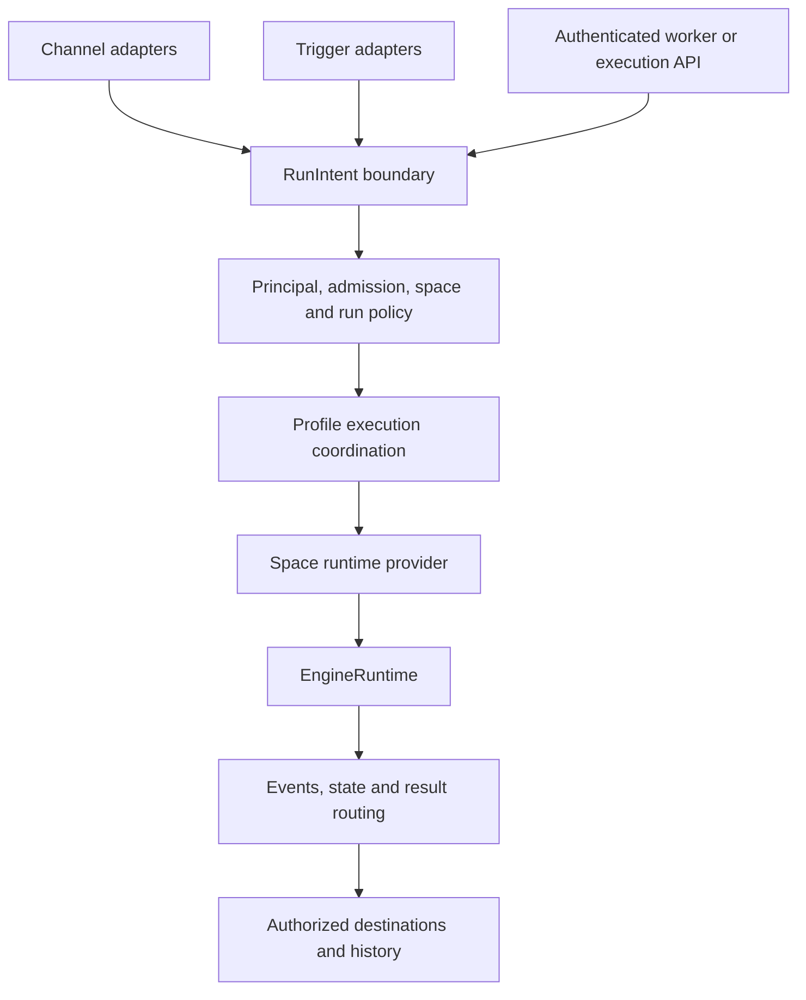

# Execution space architecture

> Status: target semantics below are implemented through E5.3 behind an
> explicitly prepared host composition. Personal and legacy team behavior remain
> compatible. Management activation/migration (E6) and deployment certification
> (E7) are still pending; implementation is not live deployment acceptance.
>
> Original design baseline: local main at `d8cd9a1fb242d6bfaaa0e89c290e02c53e7f0b83`,
> reviewed on 2026-09-07. Implementation progress and the next bounded task are
> tracked in [Execution space delivery plan](EXECUTION_SPACE_DELIVERY_PLAN.md).

This is the source of truth for execution-space semantics. It supersedes the
design direction of the [archived User Agent Space proposal](USER_AGENT_SPACE_ARCHITECTURE.md).
The Channel, Trigger, Agent Runtime, Control Plane, and Workspace documents
retain ownership of their existing contracts; their current implementation
status must not be inferred from this target architecture.

## Decision

An execution space owns identity-bearing execution state, resource grants, and
engine runtime instances. Its identity is independent of a channel protocol,
engine name, native session id, process id, or working-directory path.

The product retains two profile modes:

| Property | `personal` | `team` |
| --- | --- | --- |
| Selection | Default when mode is absent | Explicit operator selection |
| Routing | One default space for all admitted work | User spaces and shared spaces selected by trusted context |
| Conversation continuity | Separate scopes in the default space | Separate scopes within their owning spaces |
| Admission | Existing owner/admin/allowlist behavior | Channel-specific admission; existing Lark team usage behavior remains supported |
| Business-tool identity | Existing personal-profile policy | Space-bound service or owning-user grants |
| Administrative authority | Profile management policy | Same management boundary; ordinary users are not profile administrators |

Changing group size, receiving a DM, discovering a credential, or installing a
plugin never switches profile mode. Personal mode remains useful in groups and
does not promise isolation between people the operator admits to that profile.
Team mode does not enable channels, install packages, expose worker endpoints,
grant arbitrary filesystem access, or imply completed user authorization.

There is one profile-owned execution coordinator per live profile, with one
default space in personal mode. In team mode it coordinates all spaces through
the same run, concurrency, session, audit, and result-routing services.

For one Lark bot/account in one shared trust domain:

```text
Team profile
|-- SharedSpace
|   |-- ordinary group A / its topics
|   `-- ordinary group B / its topics
|-- UserSpace(A)
|   |-- A's direct conversation
|   |-- exclusive group A1: A + this agent
|   `-- exclusive group A2: A + this agent
`-- UserSpace(B)
    `-- B's direct and verified exclusive conversations
```

All ordinary groups in this domain share a space, not a conversation. A user's
DM and several exclusive groups share a user space, not a native thread.
Different channel accounts or identity domains do not implicitly share a
space. Cross-domain sharing or account linking requires a later explicit,
verified binding; names, emails, or equal-looking provider ids are insufficient.

## Baseline and scope

The baseline already has a versioned [Channel ABI](CHANNEL_PLUGIN_ABI_V1.md),
[RunIntent](../src/application/execution-intent/types.ts), a
[ConversationRuntime](../src/conversation/runtime.ts),
[EngineRuntime](../src/agent/runtime/types.ts), Trigger Platform, Management API,
and Native Read. This work extends those boundaries rather than constructing
a second execution system.

[E2.1 construction preparation](EXECUTION_SPACE_DELIVERY_PLAN.md#e21-completion-evidence)
now resolves immutable profile-owner/state/tool-binding context and native
constructor options for all seven built-ins. It retains the profile directory
as the compatibility owner key; that key is not a principal, authorization
grant or implemented SpaceKey. Explicit options are snapshotted; ambient
environment inheritance still happens at each engine's existing launch point.
External plugins retain their v1 input shape through a snapshot projection.

Current facts retained by E2.1:

- Normal Supervisor composition owns one execution runtime per profile and
  requires Lark application configuration. The
  [standalone worker](../src/worker/profile-config.ts) already accepts engine
  settings without channel credentials.
- `team` currently forces profile-wide Lark CLI bot-only identity. Per-user
  credentials and routing are not present.
- [Scope resolution](../src/bot/scope.ts) separates chats and topics;
  [session catalog identity](../src/session/catalog.ts) has no space dimension.
- [ChatTopologyResolver](../src/bot/chat-topology.ts) retains human/bot counts,
  with 15-second exclusive-group and 60-second ordinary-group cache defaults.
  [Addressing](../src/bot/addressing.ts) uses those counts to allow unmentioned
  exclusive-group input. Explicitly mentioned messages can bypass roster lookup
  in [Lark intake](../src/bot/channel.ts). This is addressing, not personal
  authorization.
- Codex and Grok have daemon execution runtimes. Claude, Kimi, OpenCode, Pi,
  and DSH use one-shot adapter runtimes. Separate native-history helpers may
  start additional query processes today.
- External channel composition and scheduled runtime activation have their
  own opt-ins. Space work must not silently enable them.

The scope is a maintainable single-host architecture and progressive migration.
Distributed placement, process reuse across users, automatic cross-channel
identity linking, per-user engine selection, arbitrary scheduled code, and
upgrading every engine to a new native protocol are separate decisions.

## Ownership and dependency direction



| Owner | Responsibility | Dependency restriction |
| --- | --- | --- |
| Supervisor / profile host | Compose services, own locks, lifecycle and effective configuration generation | No engine-protocol branches or provider roster algorithms |
| ChannelManager / channel adapter | Provider connection, authenticated ingress, audience observations, rendering and delivery | Cannot create engines or choose personal credentials |
| TriggerManager | Due work, occurrences, leases and retry scheduling | Time does not grant authority; cannot execute engines directly |
| Execution policy | Admission, principal resolution, space binding, resource and delivery grants | No SDK, CardKit, subprocess, or engine-native permission types |
| ConversationRuntime / RunExecutor | Queue, active turns, reservations, run lifecycle, state wiring and audit | Uses a bound runtime port; never a model-selected space |
| Space runtime provider | Single-flight acquisition, generations, capacity and disposal | Uses engine factories; does not duplicate conversation or channel ownership |
| Engine plugin / runtime | Native launch, protocol translation, session operations and capability enforcement | Treats space/scope references as opaque |
| Identity and state adapters | Confined state access and provider-specific credential operations | No ambient fallback to another space or host user |
| Management API / Runtime Admin / Native Read | Desired-state changes, runtime reconciliation, authorized reads | Separate contracts with consistent space filters |

Supervisor and standalone worker composition should reuse the same execution
host assembly while preserving their deployment and authentication boundaries.
The target execution profile can operate with zero messaging channels.
Channel account credentials and execution policy/configuration become separate
resolved inputs; legacy stored profile schemas remain readable until migration.

## Contract sketches

These are design sketches, not exported TypeScript APIs or accepted new JSON
fields. Opaque references below are host-issued handles, not authorization by
virtue of their string value. Runtime validation and trusted adapter
authentication remain mandatory.

### Identity, conversation and space

```ts
interface PrincipalRef {
  profileId: string;
  authorityRef: string;
  kind: 'user' | 'service' | 'agent';
  subjectRef: string;
}

interface ConversationRef {
  profileId: string;
  channelInstanceRef: string;
  scopeRef: string;
}

type SpaceKey =
  | { kind: 'default'; profileId: string }
  | { kind: 'shared'; profileId: string; trustDomainRef: string }
  | { kind: 'user'; profileId: string; principal: PrincipalRef };

interface ConversationSpaceBinding {
  conversation: ConversationRef;
  spaceId: string;
  version: number;
  audienceEvidenceRef: string;
  state: 'active' | 'suspended' | 'retired';
}
```

The principal authority namespaces the provider, account/application and true
tenant identity where applicable. Lark's configured `feishu`/`lark` tenant
brand is not a tenant identifier. The identity adapter issues a stable authority
reference only after resolving the required source identity. An app/account
identity replacement retires its bindings; it cannot transfer credentials.

User SpaceKey values require `principal.kind === 'user'` and an identical
profile id. Shared trust domains are deployment-owned, not supplied in a
message. Default team trust domains are separated by channel account/authority;
all ordinary Lark groups under the same bot binding use one shared domain.

Canonical serialization of the complete key produces a stable opaque space
id. Do not concatenate ambiguous raw ids, put raw identities in directory names,
or mutate a key when its owner changes. Cross-profile state is never reusable.
Local CLI operators have authenticated control actors; they are not fictional
chat users. Scheduled work can retain a user principal through a valid grant,
or use an explicitly granted service principal and shared domain.

### Audience evidence and routing

A channel identity adapter supplies verified conversation facts, including:
conversation reference, sender principal/type, self identity, audience kind,
complete participant evidence when available, observation time, and revision
or local invalidation epoch. Evidence lives behind a private reference.

The pure routing policy consumes those facts, admission outcome, mode and
existing bindings. It performs no membership API calls and consumes no
model-generated identity fields.

| Condition after admission | Routing decision |
| --- | --- |
| Personal mode, any admitted source | Default space; preserve current scope semantics |
| Team, verified private user conversation | That user's space |
| Team, complete roster with exactly one human and this agent, sender is that human | That user's space |
| Team, ordinary group, including profile-owner input | Shared space in the account's trust domain |
| Team, one human with more than one bot | Shared space; no exclusive addressing inference |
| Team, missing or contradictory personal identity/audience evidence | Deny personal routing; suspend an existing personal binding |
| Team, authorized trigger or service input | Space fixed by its verified grant and binding |
| Any mode, untrusted worker identity or failed admission | Reject before reading session or credential state |

No unknown group is silently treated as private. A new public request can use
an explicitly admitted shared path without personal history or grants; a
previously personal run can never fall back into that path. Bot-originated
input does not become a human principal because its text names a person.

Addressing, admission, space routing, tool authorization and delivery
authorization are separate decisions. A structured mention can establish
addressing, but it cannot bypass the audience check needed for a user space.

### Bound run and runtime acquisition

```ts
interface AuthorizedRunContext {
  intentId: string;
  profileId: string;
  principal: PrincipalRef;
  spaceId: string;
  executionScopeRef: string;
  bindingRef: string;
  bindingVersion: number;
  authorizationRef: string;
  policyFingerprint: string;
  allowedResultRouteRefs: readonly string[];
  expiresAt: number;
}

interface RuntimeBinding {
  spaceId: string;
  engineId: string;
  generation: number;
}

interface SpaceRuntimeLease {
  binding: RuntimeBinding;
  // The existing execution contract, extended through a versioned migration.
  execution: AgentAdapter;
  release(): Promise<void>;
}

interface SpaceRuntimeProvider {
  acquire(context: AuthorizedRunContext): Promise<SpaceRuntimeLease>;
  quiesce(
    spaceId: string,
    reason: string,
  ): Promise<{ resume(): Promise<void> }>;
  close(): Promise<void>;
}
```

The authorized context is derived inside the trusted application boundary
from the existing RunIntent and live grants. It is not a new request surface
on which callers may freely set `spaceId`. Non-chat work uses a durable
execution/grant binding; it does not invent a conversation. If these fields
cross an authenticated worker boundary, their integrity and replay protection
must be verified there, not inferred from TypeScript types.

Acquire validates profile, binding, grant, policy and expiry, then reserves
capacity and resolves one runtime generation. Queue waits require revalidation.
Preparation, execution, steering, interruption and event persistence retain
that exact lease until terminal cleanup. Release is idempotent and does not
close a runtime used by other runs. Reconnect or an engine switch cannot move
an active run between generations. Registry startup failure releases capacity
and removes the failed creation promise so a bounded retry can succeed.

Quiesce blocks new acquisitions and drains or interrupts active work according
to the authorized lifecycle operation. Its resume handle is idempotent, cannot
reopen a closed provider, and resumes admission only after current bindings and
grants are revalidated. Nested quiesce operations retain independent barriers.

Read-only operations use a separately authorized query acquisition contract
owned by the same provider. They do not invent an agent run to list history.
Query leases retain space, engine and generation ownership through completion,
participate in draining, and cannot start a second daemon on an occupied state
root. E2.2 specifies the query port alongside execution and disposal.

Stable failure classes include `unverified-principal`,
`audience-unverified`, `binding-stale`, `grant-revoked`,
`policy-expired`, `space-capacity-exceeded`, `space-draining`,
`isolation-unsupported` and `session-owner-mismatch`. They contain no private
paths or provider identities. Transport retries must not convert an
authorization rejection into a new run with a different owner.

### Engine launch, policy and presentation

The resolved EngineRuntimeContext contains an immutable RuntimeBinding,
engine-specific settings, confined state/cache/run paths, a host-built launch
environment or launch handle, and supported permission/credential bindings.
It does not contain the entire profile configuration or a Lark SDK object.
Trusted integration adapters materialize provider-specific tool bindings;
the engine does not decide which account to load.

Core policy describes allowed filesystem roots and operations, network/tool
grants, interaction policy, resource ceilings and result destinations. Plugins
map that policy to their native launch/session controls. A plugin must enforce
the requested ceiling or return `isolation-unsupported`; a permissive native
flag is not a substitute for an unsupported restriction.

Static permission ceilings and live execution capabilities remain distinct.
Duplicate declarations of the same capability must be reconciled through
contract tests. Generic capability types must not carry CardKit markers,
Lark prompts, Codex sandbox types or Claude permission modes.

A prompt composer combines core instructions, source-specific presentation,
authorized tool instructions and run context. Engine adapters handle native
system-prompt injection and stream translation. Self identity is a per-run
source binding, not mutable global state on a shared adapter. Questions and
approvals use channel-neutral interaction contracts when supported; Lark
cards are a renderer using the existing managed action executor. Lack of
native interaction support never implies automatic approval.

### ABI and compatibility

Channel ABI v1, Engine Runtime v1 and RunIntent v1 remain unchanged in Phase 1.
Introduce internal compatibility adapters first. Public additions require an
explicit version, runtime validation, fixtures and a compatibility matrix.
Do not insert new fields into strict v1 JSON and hope old plugins ignore them.

Legacy plugins remain usable on the existing personal/default-space path.
Team support is an explicit, tested capability of an engine/deployment and
channel combination. A v1 adapter without verified identity or state isolation
does not gain team support merely by accepting a new directory argument.

The v1 `profile-daemon` topology describes today's owner. A future contract
must separate runtime ownership from process topology instead of quietly
changing that published value's meaning. Execution leases and session references
remain generic even when an engine uses remote connections or session workers.

## Exclusive-conversation binding lifecycle

Exclusive groups are personal execution entry points, but remain group
conversations at the provider. Private OAuth and disclosure rules must use the
actual provider conversation type.

Bindings follow `unbound -> active -> suspended -> retired`; reactivation
requires fresh evidence and a new binding version. Membership changes invalidate
personal routing immediately when observed. Cached counts alone cannot grant
personal credential use. Complete roster evidence must identify the human and
this exact agent; membership events and checks at execution/delivery boundaries
jointly fence stale work.

When an exclusive group gains another human or bot:

1. suspend its personal binding and stop accepting personal follow-ups;
2. fence pending input, callbacks, history reads, tool grants and result sends;
3. interrupt or retain the affected run according to existing authorized
   lifecycle policy, without automatically redirecting its output;
4. after shared admission succeeds, create a new binding version and fresh
   conversation in the shared space;
5. retain earlier personal sessions and artifacts in their original user space.

An ordinary group becoming exclusive also starts a fresh conversation binding.
Replacing its sole human never resumes the previous person's session.
Historical replay is limited to the applicable binding epoch, including REST
history backfill, quoted context and recovery checkpoints; current membership
cannot retroactively authorize older personal material.

Provider membership reads and sends are not an atomic transaction. The system
cannot revoke messages already delivered or promise permanent DM confidentiality
for a group. Results requiring that guarantee stay in an authenticated private
destination; failure to validate the audience holds the output rather than
failing open. A provider without sufficient evidence may support ordinary
shared groups while exclusive-group personal execution stays unavailable.

## Identity, storage and resource isolation

### Credential ownership

| Credential class | Owner and boundary |
| --- | --- |
| Channel connection | Channel account/instance; not copied into every agent environment |
| Model provider access | Explicit deployment/engine account binding; separate from business-user OAuth |
| Business-tool user grant | Principal and space; authorization subject must match the owner |
| Shared service/tool grant | Explicit shared trust domain and resource ceiling |
| Management/automation authority | Authenticated operator or scoped grant; never inherited merely from team usage |

Private spaces start without another person's authorization. Never seed them by
copying the operator's entire engine home, CLI config, credential cache or
personal sessions. Model access can be explicitly provisioned through a
deployment-approved binding without importing that user's conversation state.

For Lark, shared spaces are permanently bot-only. User spaces may use their
owner's verified grant; the legacy profile-wide team bot-only projection must
become a space-aware effective policy before that capability is enabled.
OAuth initiation, URL display and completion remain in real `p2p` chats.
Transactions bind the principal, app/authority, space, expiry and continuation;
a reply such as "done" alone cannot choose an authorization transaction.
Successful OAuth must verify the returned user matches the space owner before
activation. Mismatch, cancellation, expiry and revocation invalidate the pending
grant; completion and continuation retries must not repeat committed writes.

A verified exclusive group can reuse its owner's completed grant only under
valid audience, tool and delivery authorization. This does not permit OAuth
links in that group. Profile-binding faults or identity-policy rejection are
distinct from missing OAuth; never clear bound environment variables or switch
profiles to bypass them. Other integrations supply their own consent and
subject-verification adapters without making Lark a core dependency.

### State and paths

Compose the existing [root and lifecycle layout](WORKSPACE_AND_STATE_LAYOUT.md).
State remains under ARIA_HOME; working files remain under ARIA_WORKSPACE_HOME
or explicitly authorized project locations. A proposed logical projection is:

```text
profiles/<profile>/spaces/<opaque-space-id>/
  metadata.json
  identity/
  state/
  engines/<engine-id>/
  cache/
  logs/
  run/

<workspace-home>/<profile>/spaces/<opaque-space-id>/
  default/
```

This is a future resolver contract, not today's physical layout. Default-space
compatibility maps existing paths without moving files or eagerly creating a
new tree. Schema, layout and binding versions have separate meanings. Paths
come from pure typed resolvers; owning stores initialize lazily with atomic
writes and private permissions. Raw identities, tokens and machine-specific
project paths do not belong in generated workspace templates.

Session identity includes space, namespaced conversation/execution scope,
binding epoch, engine/session kind, real workspace path and policy fingerprint.
Native handles are opaque, engine-tagged references whose ownership is verified
before resume. Engine generation identifies the live process, not the durable
session; same-engine restart may resume after revalidation. Engine switching
starts a fresh compatible session and preserves old history.

Namespace session catalogs, workspace mappings, attachment stores, pending
inboxes, active runs, resume candidates, callback nonces, native history,
runtime telemetry, tool caches and output checkpoints. Space-restricted views
of shared stores are acceptable if the boundary enforces every read and write.
Storage backends need not be replaced solely to add a namespace.

Native Read, CLI, cards and Web enforce the caller's space visibility, including
list, summary and search endpoints. Status must not display another scope's
last model, context usage, account or conversation as the caller's own.
`/new` and ordinary `/stop` retain their conversation scope. Shared-group
collaboration policy is preserved; stricter task-initiator-only control is a
separate product change. Profile administration stays independently authorized.

Different directories or processes alone do not confine an agent running with
arbitrary host access. Team activation requires an enforced filesystem,
credential and management-endpoint boundary, using a proven engine sandbox,
restricted tools and/or OS isolation. Grants must cover all native tools,
plugins and child processes, not just Lark CLI. Restrict symlinks, path escapes,
ambient engine homes and unrestricted host configuration inheritance.

Shared groups deliberately share a trust/resource domain. Concurrent writes to
one project still require task workspaces, locks or leases; a conversation key
is not a filesystem lock. Tool access is limited by the originating grant even
when a shared bot technically has broader API access.

## Runtime lifecycle and capacity

A space has at most one active engine runtime generation for the profile's
selected engine. The registry owns acquisition; the runtime owns all processes,
connections and workers it creates:

- daemon: Codex uses at most one live App Server per space; Grok uses its own
  daemon protocol. Neither process is rebound to another space;
- one-shot: a space-bound adapter may launch several run-owned processes for
  different scopes, within shared and per-space concurrency limits;
- session workers or remote engines: ownership remains space-bound, while
  worker/connection semantics stay inside the plugin. These are extension
  cases, not new implementations required by Phase 1.

Native history/status/model operations must use the same authorized runtime or
confined query boundary. A daemon history helper cannot silently create a
second server on the same state root. Privacy-neutral static model metadata may
be cached more broadly; account, history and live usage data may not.

The registry supports bounded startup, single-flight creation, failure cleanup,
crash backoff and terminal disposal. Reuse the existing run-concurrency budget
and add live-runtime capacity, bounded waiting and per-principal fairness.
One-shot runtimes consume active-run/process capacity, not fictional idle
daemon slots. Metadata-only status reads do not wake every dormant space.

Idle eviction releases native resources, preserves persistent state, and
excludes spaces with active runs, reservations, dependent queries or pending
authorization work. Recreate only after the previous runtime is fully closed.
If an engine needs fresh process state after credential revocation, drain and
replace its generation before admitting new work.

Transport-only reconnect preserves unchanged spaces. Space reset, profile stop,
engine change, app identity change and mode migration use explicit lifecycle
operations. Quiesce ingress, wait or stop work under the existing authority,
persist terminal/pending state, close old resources, then activate the new
generation. Preflight may validate configuration/binary availability without
starting a competing live daemon on the same space. Failure never exposes a
half-switched binding or resumes personal work in shared/default state.

## Source and result-path coverage

| Entry point | Required binding and behavior |
| --- | --- |
| Channel input | Trusted instance/actor/audience facts; durable acceptance remains owned by the existing channel reliability boundary |
| Lark cards | Managed action executor, operator and original run/binding checks; background I/O and terminal card state remain mandatory |
| Comment / meeting | Explicit resource/source grant; private-message classification cannot be inferred from one speaker |
| Scheduled / manual trigger | Definition binds principal, authorization ceiling, space, scope and result anchors; revalidate at dispatch and retry |
| Worker / execution API | Authenticated caller and scoped grant; raw actor/scope parameters cannot select another user's state |
| Native history / resume / reset | Space, engine, workspace and binding checks including candidate-token consumption |
| Delayed delivery / retry | Durable answer keeps its original space, grant and audience epoch; revoked destination suspends delivery without rerunning a completed agent |
| Future webhook / deterministic action | Reuse authorization/audit/result contracts through a versioned intent; no implied production endpoint or Action Runtime today |

Retain existing channel deduplication, accepted-turn membership, answer
checkpoints and trigger occurrence/lease semantics. Extending those records
requires versioned readers and recovery tests, not a second inbox or scheduler.
Do not infer exactly-once external side effects from an idempotent run or send
ledger. Native provider reply context remains opaque and instance-bound.

## Engine adoption matrix

These rows describe Aria's baseline adapters, not every capability of an
upstream product. Isolation support remains unverified until the corresponding
implementation and process tests pass.

| Engine and code | Current execution/state/history | Required team adoption and limit |
| --- | --- | --- |
| [Codex](../src/agent/engines/codex/plugin.ts) | Daemon App Server; default profile codex-home or configured/inherited home; thread resume; [history helper](../src/session/codex-history.ts) starts another query server | Confine home/config/auth and all tools; make history use the owning runtime boundary; direct text steering remains supported; at most one live server per space |
| [Grok](../src/agent/engines/grok/plugin.ts) | Daemon agent-stdio; GROK_HOME override or default inheritance; native session resume/list; [history helper](../src/agent/engines/grok/history.ts) launches its own client | Confine home and model credentials, reuse scoped query ownership, bind permission requests to active authorized runs; preserve direct text steering |
| [Claude](../src/agent/engines/claude/plugin.ts) | One-shot stream-json CLI with resume; [history reader](../src/session/history.ts) reads host .claude/projects; adapter lacks a state-root argument | Supply validated config/auth/state roots or an isolated execution environment; scope history consistently; retain one-shot execution and queued follow-ups |
| [Kimi](../src/agent/engines/kimi/plugin.ts) | One-shot ClaudeAdapter compatibility using Kimi binary; resume argument forwarding; declares native history but has no plugin listHistory implementation | Verify Kimi's actual supported state/auth and resume controls independently; expose only tested history capabilities; do not inherit Claude's filesystem assumptions |
| [OpenCode](../src/agent/engines/opencode/plugin.ts) | One-shot JSONL CLI; optional XDG data/config/cache/state overrides; history and models are separate queries | Resolve all roots and query environments from the same space; enforce effective run policy instead of assuming profile auto-approval is sufficient |
| [Pi](../src/agent/engines/pi/plugin.ts) | One-shot JSON CLI; profile pi-sessions or configured sessionDir; session argument; no plugin listHistory implementation; adapter inherits process environment | Isolate config/auth as well as sessions; use the common launch boundary; verify resume and declare history limits honestly; RPC migration is independent |
| [DSH](../src/agent/engines/dsh/plugin.ts) | One-shot headless CLI; profile dsh-home or configured DSH_HOME; aggregated output; no native resume/list wiring; adapter inherits process environment | Confine home, credentials and children; reject unenforceable policy; offer Aria run history without claiming native session continuation |

The common contract suite must test both a daemon and a one-shot adapter plus
a non-Lark input before declaring the abstraction provider-neutral. Each
remaining engine passes the same isolation gates independently. Unsupported
combinations remain available only on their compatible personal path and return
an explicit unsupported result for team activation. Isolation may not degrade;
optional history, images, streaming and live input can be honestly unavailable.

## Mode migration and rollback

Stored mode, effective runtime mode, layout version and rollout readiness are
different facts. The product exposes personal/team, not a permanent matrix of
independent space toggles. Existing team profiles retain legacy bot-only behavior
until an explicit migration plan adopts the new layout and runtime generation.
Fresh team activation also requires proven engine/channel/deployment support.
Personal startup/read operations do not migrate stored bytes.

Introduce a versioned, privileged mode-transition management command. The
baseline [preferences command](../src/application/control/profile-preferences-command.ts)
currently changes mode with a low-risk live effect; this cannot silently become
a process/identity migration. Existing UI adapters delegate to the new command.

Migration plans record source revisions, ownership evidence, affected bindings,
activity requirements, state mappings and an exact rollback manifest. Prepare
without activating personal credentials, quiesce affected work, stage state,
commit desired state, reconcile runtime, verify, and report each outcome.
Filesystem moves and configuration commits are a recoverable saga, not an
imaginary cross-filesystem atomic transaction. Reject drift before mutation.

Legacy personal state is not bulk-imported into shared team state. Proven
ownership permits an explicit scoped migration; unresolved sessions remain
archived and new conversations start fresh. Preserve evidence for old group
privacy epochs rather than classifying all history using today's roster.

Rollback closes the new runtime generation and restores the exact prior
configuration/layout projection. New private data and credentials remain
sealed in their original spaces; old readers must not discover or flatten them.
A return to personal mode may restore the operator's previous personal binding,
but never another user's authorization. Failed runtime reconciliation is
reported separately from a committed configuration and must not open new ingress
under mixed policies.

## Acceptance and continuation

The delivery plan owns named test scenarios, code-change dependencies, engine
evidence requirements and the next task. Passing Phase 1 proves the design is
reviewable and internally consistent; it does not prove production isolation.
Later activation requires the full identity, storage, engine, source, result,
lifecycle and migration gates for the enabled combination.
